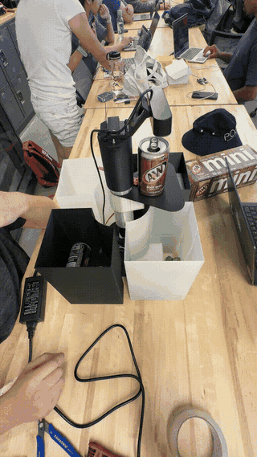
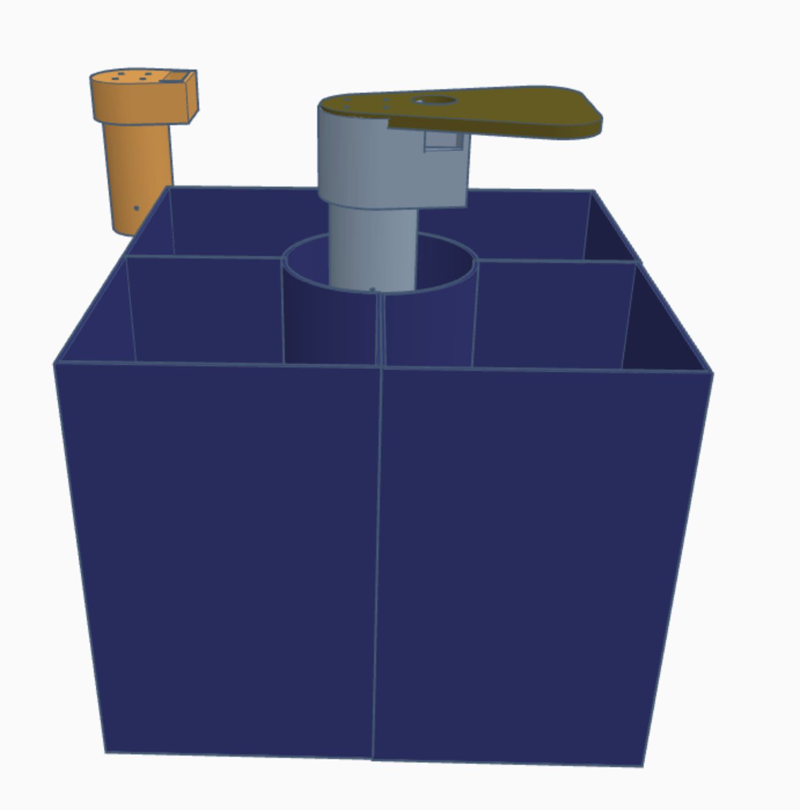
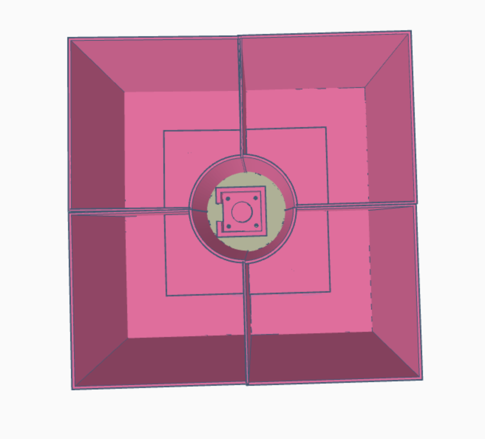
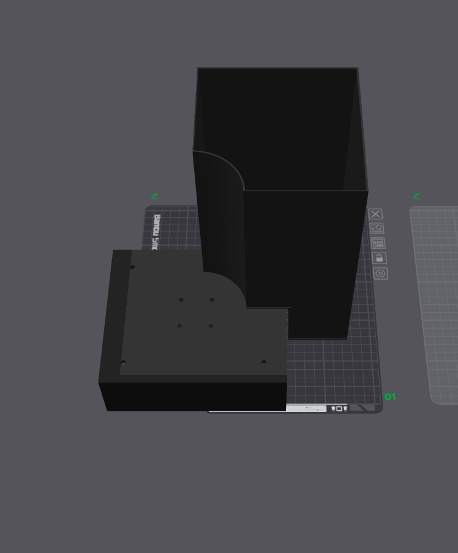
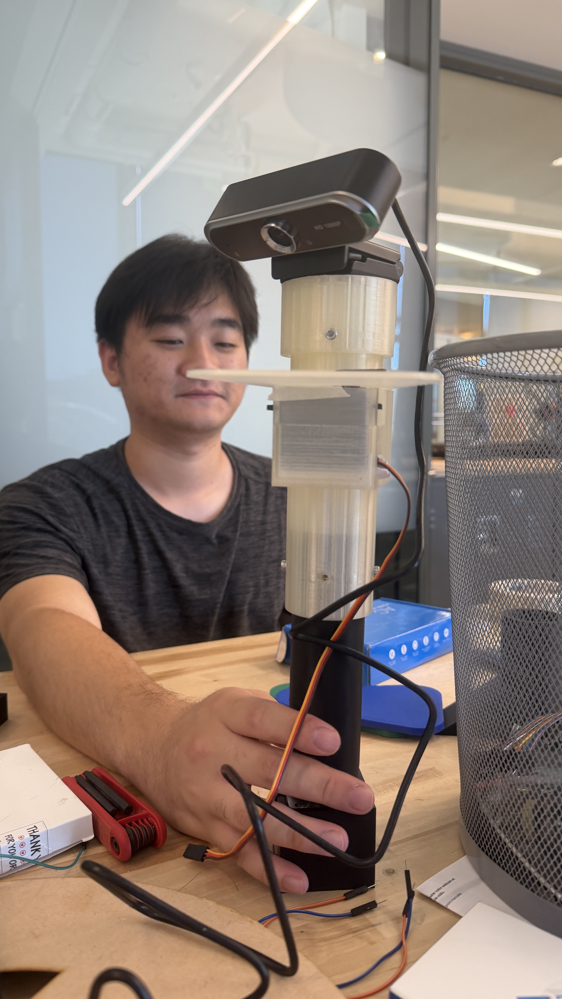
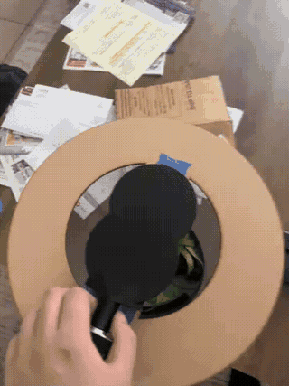
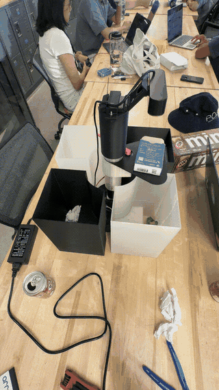
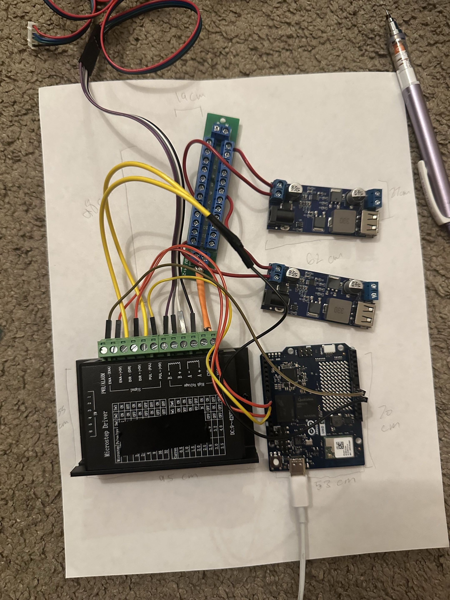
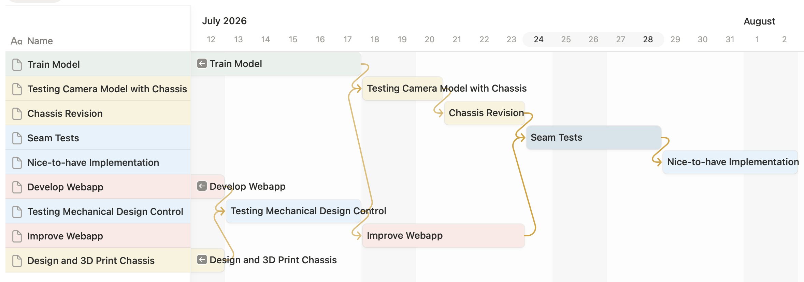

<p align="center">
  
</p>

# UCSD ECE 180 Summer 2026 Team 12 Final Project: Bin-ary Sort

*Waste sorting with computer vision, on the Arduino UNO Q.*

<p align="center">
  
</p>

## Team Members

| Name | Major | Year |
|------|-------|------|
| Colin Hua | ECE — Electrical Engineering | 2027 |
| Duy Nguyen | ECE — Computer Engineering | 2027 |
| Aram Zarate Ubario | ECE — Computer Engineering | 2027 |

**Course:** ECE 180 — Prof. Silberman, UC San Diego, Summer 2026

## Project Overview

Bin-ary Sorter is a smart trashbin that sorts your trash for you. You drop an
item in, and it lands in the right one of four bins. No phone, no app, no cloud
call, and nothing for the user to do.

A USB camera on top of the bin looks down and grabs a frame. A fine-tuned
**MobileNetV3-Large** classifies it into one of 30 waste classes from the Kaggle
dataset, that label collapses down to a bin number, and a NEMA-17 stepper
rotates the pole to that bin. All of the inference runs **on the board itself**,
on the UNO Q's Qualcomm Dragonwing Linux side. The STM32 MCU sitting on the same
board handles the real-time motor timing, and the two halves talk over Arduino's
**RouterBridge** RPC. Plug it in and it starts: both the classifier and the motor
controller come up on their own at boot.

If the model isn't sure, the bin doesn't guess. It sends the frame to our web
dashboard and asks a person which bin it should have been, and that answer goes
back into the training set for the next retrain.

## Goals

### Original Goals
- Train a transfer-learning waste classifier accurate enough to run quantized on an edge MPU
- Run inference fully on-device on the Arduino UNO Q (no cloud inference)
- Drive a rotating-pole sorting mechanism from the classification result
- Build a web dashboard showing live status and classification confidence

### Goals We Met
- MobileNetV3-Large fine-tuned to **89.1% test accuracy / 0.890 macro-F1** across 30 classes
- Exported to ONNX + three TFLite variants with **measured** per-variant accuracy, size, and latency
- Full on-device pipeline: camera → classify → bin index → stepper move, autostarted at boot
- **2-category sorting** through the single-axis rotating-pole chassis — later extended to 4 (see Stretch Goals)
- Web dashboard with correct/wrong human feedback (reinforced-learning loop)
- Second motor (servo arm) added to the mechanism late in the schedule

### Stretch Goals
- **4-category sorting** through the 2-axis double-motored rotating system — *Done*
- Federated learning across bins for a network effect — *Done*
- Higher-throughput continuous-feed sorting rather than one item at a time — *in progress*

## System Hardware

| Component | Purpose |
|-----------|---------|
| Arduino UNO Q (Qualcomm Dragonwing QRB2210) | Primary compute — quad Cortex-A53 + Adreno 702, Debian Linux |
| STM32U585 MCU (Zephyr, on-board) | Real-time stepper/servo control, reached over RouterBridge RPC |
| USB webcam | Item capture at the drop chute |
| NEMA-17 stepper + driver | Rotates the sorting pole to the target bin |
| Servo arm | Second-stage actuation (added late; `SERVO_ENABLED` gate) |

## Model & Dataset

**Dataset:** [Recyclable and Household Waste Classification](https://www.kaggle.com/datasets/alistairking/recyclable-and-household-waste-classification)
— 30 classes, ~15k images, each class split into `default` (studio) and
`real_world` (cluttered) subsets.

We split it 70/15/15, stratified by *(class, subset)*, so the `real_world`
images show up in val and test in the same proportion as in training. This
matters more than it sounds: if we had let the studio shots dominate the test
set, our numbers would look better than what the bin's camera actually sees.

| Metric | Value |
|--------|-------|
| Test accuracy (fp32) | **89.08%** |
| Macro-F1 | **0.890** |
| Parameters | 4.24 M |
| `default` vs `real_world` accuracy | 89.2% vs 88.9% (no meaningful domain gap) |

Training is a two-stage fine-tune (head-only warmup, then full fine-tune) with
AdamW + cosine schedule, label smoothing 0.1, AMP, EMA weights, MixUp/CutMix,
class-balanced sampling, and augmentation meant to imitate a cheap camera. None
of that survives into deployment. What we export is one plain network.

### Quantization results

We re-scored every exported variant on the real test set instead of assuming the
quantized model kept the fp32 accuracy:

| Variant | Test acc | Size | Recommended threshold |
|---------|----------|------|-----------------------|
| fp32 | 89.08% | 17.1 MB | 0.75 |
| dynamic-int8 | 87.37% | 4.63 MB | 0.55 |
| **static-int8 (shipped)** | **86.36%** | **4.87 MB** | **0.80** |

**We ship static-int8.** It costs us 2.7 points of accuracy against fp32, but
it is 3.5× smaller, it is the fastest of the three on the board, and its
quantization ranges are calibrated on `real_world` training images so they line
up with what the camera sees. The confidence gate covers the accuracy we gave
up: at its measured 0.80 threshold, the predictions the bin accepts on its own
are still 95.0% correct, and everything below that goes to a person.

### Measured on-device latency

Benchmarked on the UNO Q itself (aarch64, quad Cortex-A53, TFLite XNNPACK CPU
delegate, 256×256 int8 input, 50 timed invocations after warmup):

| Threads | Median | Mean | Min – Max |
|---------|--------|------|-----------|
| 1 | 79.8 ms | 80.1 ms | 79.2 – 83.1 ms |
| **4 (shipped)** | **26.5 ms** | **27.3 ms** | **26.0 – 35.1 ms** |

`infer_uno_q.py` runs the interpreter with `num_threads=4`, so **~27 ms per
frame** is what a real classification costs us. That is nothing next to how long
the stepper takes to settle, so the model is never the slow part of a drop
cycle. This is inference only; camera capture and preprocessing sit on top of
it. We never needed the GPU delegate.

## Mechanical Design

Four bins sit in a round casing around a **rotating pole**. The pole always
takes the shorter way around to the target bin, clockwise or counter-clockwise,
and a tie goes clockwise. The move blocks until the pole actually gets there, so
when the software gets an acknowledgment it means the motion finished, not just
that the command was received.

We rebuilt the chassis once. The first design failed during seam testing and had
to be reprinted, which is the revision block you can see in the Gantt chart
below.

### Final design renders

| | |
|---|---|
|  |  |



### Double-motored rotating pole

This is the 2-axis mechanism that got us from 2 categories to 4. The stepper
rotates the pole to the target bin, then the servo arm sweeps the item off the
platform and into it.



### Printable parts

Every part of the chassis is in [`STL/`](STL/):

| File | Part |
|------|------|
| `Bottom_column.stl` | Base column the rotating pole sits on |
| `Camera_mount.stl` | Camera mount at the top of the pole |
| `Camera_platform.stl` | Platform the camera looks down onto |
| `Camera_securer.stl` | Retainer clamping the camera to the mount |
| `Component_tray.stl` | Tray holding the UNO Q, driver, and buck converters |
| `Component_lid.stl` | Lid for the component tray |
| `Nema_holder.stl` | NEMA-17 stepper bracket |
| `Servo_holder.stl` | MG996R servo bracket |
| `Trash_bins.stl` | The four-bin round casing |
| `Wooden_rim.svg` | Laser-cut outer rim (2D profile, not printed) |

## Demo

Our first end-to-end run, sorting into 2 categories with the single-axis pole:



And the finished bin sorting into all 4, using the double-motored mechanism:




*(These are downscaled for the page. Full-resolution originals are in
[`docs/images/`](docs/images/).)*

## Build Guide

How to go from a pile of printed parts to a working bin.

### 1. Power distribution



Everything runs off one AC/DC supply into a single terminal-block splitter, and
that terminal fans out three ways:

| Branch | Feeds | Notes |
|--------|-------|-------|
| 12 V direct | NEMA-17 stepper driver | Motor supply pins on the driver, not the logic side |
| 12 V → 5 V buck #1 | Arduino UNO Q | Board logic and the STM32 side |
| 12 V → 5 V buck #2 | MG996R servo, exclusively | Deliberately off the UNO Q's rail. The servo's stall current would brown the board out. |

Keep the servo on its own converter. That separation is the whole point of
having two bucks rather than one.

### 2. Signal wiring

- **Stepper driver.** Wire Enable (`ENA`), Direction (`DIR`), and Pulse (`PUL`)
  from the driver to the UNO Q's digital I/O. Ours are **PUL = 2, DIR = 3,
  ENA = 4**, common-anode active-LOW, with the driver DIPs on 1/8 microstep
  (1600 steps/rev, so 400 steps per bin).
- **Servo.** Connect the servo's PWM signal wire to its control pin on the
  UNO Q. Ours is **D6**, picked to stay clear of the stepper's 2/3/4.

### 3. Base enclosure

1. Arrange all the wired electronics inside the base enclosure
   (`Component_tray.stl`).
2. Put the cover (`Component_lid.stl`) over the tray to close everything in.
3. Install four M3 heat-set inserts into the marked holes on top of the lid with
   a soldering iron. Once they've cooled, bolt the stepper bracket
   (`Nema_holder.stl`) to the lid with four M3 screws.

### 4. Camera apparatus

1. Connect the adjustable shaft to the column (`Bottom_column.stl`) and pin it
   at whichever of the pre-spaced height holes gives you the elevation you want.
2. Slide the servo into its housing (`Servo_holder.stl`) on the column.
3. Mount the camera housing (`Camera_mount.stl`) and the tail platform
   (`Camera_platform.stl`) on top of the column/servo assembly, then clamp the
   camera down with `Camera_securer.stl`.
4. Fasten the rest of the camera parts together with M3 screws wherever the
   print calls for them. Rigidity matters here: the camera has to stay pointed
   at the same spot or the framing drifts away from what the model was
   calibrated on.

### 5. Final setup

Position the four collection baskets (`Trash_bins.stl`, with `Wooden_rim.svg`
laser-cut as the outer rim) around the outer edge of the machine so each one
sits under its bin position. Then power on: the classifier and motor controller
start themselves, and the bin is ready to sort.

### Two power problems that cost us time

#### The camera needs a powered USB hub

The UNO Q **cannot power the USB camera while the board itself is being powered
through the pin header.** There isn't enough left over on its USB rail. The
camera has to hang off a powered hub instead:

```
UNO Q ──USB-C──> powered USB hub ──USB-A──> camera
```

If you plug the camera straight into the board while the board is running off
the buck converter, it will enumerate, look fine, and then drop out as soon as
anything draws current.

#### Size the supply above 66 W

Our demo pulls about **66 W** at peak: stepper holding torque, servo actuation,
board, and camera all at once. We ran it on a **60 W** supply, and that gap is
not a margin note, it is an actual failure mode. When the rail sags, some UNO Q
pins get stuck **LOW** and stay there. In our case it was almost certainly the
**DIR** pin. The stepper still stepped just fine, but the shaft would only ever
turn one direction and never reverse.

So if the pole rotates but refuses to go counter-clockwise, **check your power
supply before you touch the sketch.** We lost a day to this. A 12 V supply with
real headroom over 66 W (8 A, around 96 W) makes the whole symptom disappear.

## Accomplishments

### On-device classification
The Linux side copies the notebook's `eval_tf` preprocessing exactly: resize the
shorter side to ~293, center-crop to 256, ImageNet mean/std. We were careful
about this because a preprocessing mismatch is the most common reason a model
works in Colab and falls apart on the device. The model, the labels, and the
thresholds all get read out of the export directory, so putting a retrained
model on the bin is just a file copy.

### Two-processor split
The STM32 on the UNO Q is not a serial tty. The only way to reach it is Arduino's
**RouterBridge**, and that bridge only exists inside an Arduino App Lab app. So
motor control had to become its own App (`deploy/motor_app/`, installed at
`~/ArduinoApps/nema17`). It opens an HTTP command port on `:8071`, the classifier
POSTs a target bin to it, and the App turns that into a `Bridge.call("sort", bin)`
down to the MCU.

### Plug-and-play autostart
We wanted the bin to just work when you plug it in, but installing a systemd
service needs a sudo password the board won't give us. So autostart is two
`@reboot` entries in the `arduino` user's crontab. `start_motor_app.sh` waits for
docker and the App Lab daemon to be up before starting the motor App, and
`run_trashbin.sh` runs the camera loop inside a wrapper that restarts it if it
dies. If the motor App happens to be down, sort calls just fail quietly instead
of taking the classifier with them.

### Confidence-gated clarification loop
The raw softmax from a label-smoothed model is not a real probability, so we fit
**temperature scaling** on the val set (T = 0.55), sweep thresholds, and then
re-measure the threshold separately for each TFLite variant. The rule we use is
the lowest threshold whose auto-accepted predictions are still ≥95% correct,
which gets us the most coverage we can have at that accuracy floor. Anything
under the threshold gets posted to the webapp with its top-k guesses, a person
picks the right label, and that correction goes into the shared training set.

### Web dashboard
Recent classifications with confidence bars, a review queue of the low-confidence
frames with correct/wrong buttons, and status tiles for the web server, the
board, and the model.

**Live at [ece180.duythe.dev](https://ece180.duythe.dev).**

## Challenges & Solutions

| System | Challenge | Solution |
|--------|-----------|----------|
| Chassis | Original design failed under load / seam testing | Full chassis revision and reprint before integration |
| MCU access | STM32 is not exposed as a serial device on the UNO Q | Moved motor control into an Arduino App Lab app talking over RouterBridge RPC |
| Autostart | systemd install requires a sudo password | Two `@reboot` crontab entries with self-restarting wrappers |
| Python env | Board Python is externally managed, no venv available | `pip install --user --break-system-packages`, `PYTHONPATH` pointed at `~/.local` |
| Quantization | int8 shifts logits, invalidating a single fixed threshold | Re-measured accuracy *and* threshold per exported variant |
| Confidence | Label smoothing makes softmax overconfident | Temperature scaling fitted on val, threshold chosen by measured accept-accuracy |
| Power | 60 W supply against a 66 W demo draw — pins pinned LOW (DIR), so the shaft only turned one way | Diagnosed as brownout rather than a firmware bug; split the rails across two bucks and sized the supply above the real draw |
| Camera power | UNO Q can't power the USB camera while itself powered through the pin header | Camera moved behind a powered USB hub off the board's USB-C |

## Lessons Learned

- Measure it, don't assume it. Accuracy, latency, and the confidence threshold all had to be re-measured for every export variant. None of them carried over from the fp32 model the way we expected.
- Matching your preprocessing between training and deployment is worth more than any clever training trick you can add on top.
- Assume the mechanism will need a revision. Our first chassis was wrong, and the only reason the schedule survived is that we had already planned time for a reprint.
- Research the platform before you architect around it. The RouterBridge and App Lab constraint on the UNO Q reshaped our entire software design, and it would have been a lot cheaper to find that out in week one.
- Sometimes a good product design solves a lot of engineering problems.
- Check your power budget before you start debugging code. We spent a day chasing a stepper that would only turn one direction, and it was a 60 W supply under a 66 W load the whole time.

## Next Steps

- **Federated learning:** aggregate corrections across deployed bins so every bin improves from every other bin's mistakes
- **Higher-resolution / continuous feed:** sort a stream of items rather than one drop at a time
- **Recover the int8 accuracy gap:** quantization-aware training, or fp16 on the Adreno 702 GPU delegate — at 27 ms per frame there is plenty of latency headroom to spend on a more accurate variant

## Gantt Chart



| Task | Window (July 2026) |
|------|--------------------|
| Train Model | 12 – 18 |
| Design and 3D Print Chassis | 12 – 13 |
| Develop Webapp | 12 – 13 |
| Testing Mechanical Design Control | 13 – 17 |
| Improve Webapp | 18 – 23 |
| Testing Camera Model with Chassis | 18 – 20 |
| Chassis Revision | 20 – 22 |
| Seam Tests | 22 – 26 |
| Nice-to-have Implementation | 28 – Aug 2 |

## Videos and Resources

- **Live dashboard:** [ece180.duythe.dev](https://ece180.duythe.dev)
- **Sorting demos:** full-resolution clips in [`docs/images/`](docs/images/) (`2-category-demo-full.gif`, `demo-1-full.gif`, `demo-2-full.gif`, `demo-3-full.gif`)
- **Dataset:** [Recyclable and Household Waste Classification](https://www.kaggle.com/datasets/alistairking/recyclable-and-household-waste-classification) on Kaggle
- **Full training pipeline:** [`ECE180_Complete_Notebook.ipynb`](ECE180_Complete_Notebook.ipynb)
- **Printable parts:** [`STL/`](STL/)

## Project Reconstruction

### Hardware Requirements
- Arduino UNO Q
- USB webcam **+ a powered USB hub** (the board cannot power the camera on its own — see [Build Guide](#build-guide))
- NEMA-17 stepper + stepper driver (1/8 microstep)
- MG996R servo (second stage)
- 12 V power supply — **8 A / ~96 W recommended**; the demo draws ~66 W and a 60 W unit browns out
- One distribution terminal + two 12 V → 5 V buck converters (one for the UNO Q, one for the servo)
- 3D-printed chassis — all STLs in [`STL/`](STL/), see [Printable parts](#printable-parts)

### Training

1. Set the Colab runtime to **T4 GPU**.
2. Add Colab Secrets: `GITHUB_TOKEN`, `KAGGLE_USERNAME`, `KAGGLE_KEY`.
3. Run `ECE180_Complete_Notebook.ipynb` top to bottom — **run the export cell (Cell 13) last**, since `litert-torch` pins torch versions and can disturb the training environment.

The dataset downloads once via kagglehub into Google Drive; checkpoints and
results persist there, and training is multi-session safe — if Colab
disconnects, re-running resumes from the last epoch including EMA state.

### Deployment

1. Connect to the board over the standard UNO Q SSH login (`ssh arduino@uno-q.local`,
   or the board's IP on the same network) and copy `deploy/` plus the exported
   `.tflite` and `labels.txt` across with `scp`.
2. Install host deps to the user site: `pip install --user --break-system-packages ai-edge-litert opencv-python-headless numpy pillow requests`.
3. Install the motor App to `~/ArduinoApps/nema17` and `arduino-app-cli app start` it.
4. Verify the stepper pins in `deploy/motor_app/sketch/sketch.ino` — **PUL=2 / DIR=3 / ENA=4**, common-anode active-LOW, 1600 steps/rev → 400 steps/bin.
5. Add the two `@reboot` crontab entries (`start_motor_app.sh`, `run_trashbin.sh`).
6. Set `MOTOR_ENABLED=1`, `MOTOR_URL=http://127.0.0.1:8071`, plus `TEMPERATURE` and `CONFIDENCE_THRESHOLD` for the shipped variant.

Full technical detail, file-by-file, is in [`docs/TECHNICAL.md`](docs/TECHNICAL.md)
and [`docs/MOTOR_CONTROL.md`](docs/MOTOR_CONTROL.md).

### Troubleshooting

| Problem | Fix |
|---------|-----|
| Sort RPCs come back `landed=N` but the pole never moves | The sketch's pin constants don't match how the driver is actually wired. Check `PUL`/`DIR`/`ENA` against the board. |
| The pole only ever turns one direction and never reverses | Almost always power, not code. Your supply is under the ~66 W draw and a pin (usually `DIR`) is stuck LOW. |
| The pole turns the wrong way | Swap the `CW` / `CCW` constants in the sketch. |
| The pole over- or under-shoots a bin | `STEPS_PER_REV` doesn't match the driver's DIP microstep setting. Rescale it. |
| Accuracy is far worse on the board than it was in Colab | Preprocessing mismatch. The device path has to match `eval_tf` exactly. |
| Motor calls silently do nothing | The App Lab app isn't running. Start it with `start_motor_app.sh`. |
| The camera enumerates and then drops out | It's plugged straight into the board. Move it behind a powered USB hub. |

After any sketch change: `arduino-app-cli app restart ~/ArduinoApps/nema17`.

## Repository Structure

```
.
├── README.md                        # this report
├── ECE180_Complete_Notebook.ipynb   # Full pipeline: download → train → eval → export
├── deploy/                          # UNO Q runtime (camera loop, inference, motor App)
├── webapp/                          # dashboard + clarification service
├── exports/                         # ONNX model, labels.txt, quantization + calibration reports
├── results/                         # test_results.json, domain_shift.json, confusion_matrix.png
├── STL/                             # printable chassis parts + laser-cut rim
└── docs/
    ├── TECHNICAL.md                 # implementation reference, file by file
    ├── MOTOR_CONTROL.md             # motor command path + as-built firmware log
    ├── BACKGROUND_ML.md             # appendix: the ML side, explained from zero
    ├── BACKGROUND_ELECTROMECHANICAL.md  # appendix: motors, drivers, power
    └── images/                      # demo GIFs, renders, wiring photo, Gantt chart
```

### Documentation

Everything supporting this report lives in [`docs/`](docs/):

| Document | What's in it |
|----------|--------------|
| [`TECHNICAL.md`](docs/TECHNICAL.md) | The implementation, file by file: training setup, repo layout, deployment steps, and the clarification loop |
| [`MOTOR_CONTROL.md`](docs/MOTOR_CONTROL.md) | How a motor command travels from a laptop to the two motors, the full command surface, and our as-built firmware notes (servo overheating, motion ramp, manual zeroing) |
| [`BACKGROUND_ML.md`](docs/BACKGROUND_ML.md) | Appendix. The machine-learning side written from zero: dataset splitting, transfer learning, the training recipe, calibration, and quantization |
| [`BACKGROUND_ELECTROMECHANICAL.md`](docs/BACKGROUND_ELECTROMECHANICAL.md) | Appendix. The other half, also from zero: power, grounding, servos, steppers, microstepping, and how software turns into motion |
